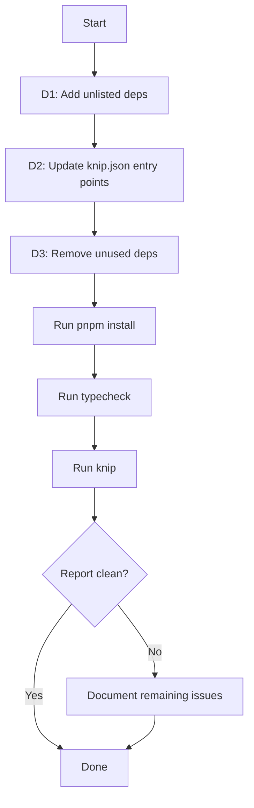

# Knip Cleanup — Design

## Approach

This is a configuration and dependency hygiene task with three distinct change areas. Each is independent and can be executed in sequence without side effects between them.

## Change Areas

### D1: Add Unlisted Dependencies to package.json

**Target file:** [`apps/stage-tamagotchi/package.json`](apps/stage-tamagotchi/package.json)

**Strategy:** Use `pnpm --filter @proj-airi/stage-tamagotchi add replicate @formkit/auto-animate` to add both packages to `dependencies` and update the lockfile. This is safer than manual JSON editing because pnpm resolves the correct version range and updates `pnpm-lock.yaml` atomically.

**Note:** `replicate` is used in the main process (Electron node side) and `@formkit/auto-animate` is used in the renderer. Both belong in `dependencies` (not `devDependencies`) since they are runtime imports.

### D2: Refine Knip Entry Configuration

**Target file:** [`knip.json`](knip.json)

**Current entry for `apps/stage-tamagotchi`:**

```json
"entry": [
  "src/main/index.ts",
  "src/preload/index.ts",
  "src/renderer/main.ts",
  "src/renderer/beat-sync.main.ts"
]
```

**Proposed entry:**

```json
"entry": [
  "src/main/index.ts",
  "src/preload/index.ts",
  "src/renderer/main.ts",
  "src/renderer/beat-sync.main.ts",
  "src/renderer/pages/**/*.vue",
  "src/renderer/layouts/**/*.vue"
]
```

**Rationale:** The app uses file-based routing via `vite-plugin-vue-layouts` and `unplugin-vue-router`. Pages and layouts are not statically imported — they are discovered at build time by Vite plugins. Knip cannot trace these dynamic entry points, so they must be declared explicitly. Adding these two glob patterns will eliminate the bulk of the 109 unused file and 62 unused export false positives.

**Verification:** The pages directory contains 30+ Vue files across subdirectories like `dashboard/`, `devtools/`, `inlay/`, `notice/`, `settings/`, and the layouts directory contains 3 files (`default.vue`, `settings.vue`, `stage.vue`). All of these are legitimate entry points.

### D3: Remove Confirmed Unused Dependencies

**Target file:** [`apps/stage-tamagotchi/package.json`](apps/stage-tamagotchi/package.json)

**Packages to remove from `dependencies`:**

| Package | Reason |
|---------|--------|
| `@huggingface/transformers` | Zero imports in `src/` |
| `@tresjs/cientos` | Zero imports in `src/`; `@tresjs/core` IS used and must stay |
| `chess.js` | Zero imports in `src/` |
| `d3` | Zero imports in `src/` |

**Packages to check for removal from `devDependencies`:**

| Package | Reason |
|---------|--------|
| `onnxruntime-web` | Zero direct imports; may be a peer dep of `@xsai-transformers/*` — verify before removing |

**Strategy:** Use `pnpm --filter @proj-airi/stage-tamagotchi remove @huggingface/transformers @tresjs/cientos chess.js d3` for the confirmed removals. For `onnxruntime-web`, check whether `@xsai-transformers/embed` or `@xsai-transformers/transcription` list it as a peer dependency before deciding.

**Important:** `@tresjs/core` must NOT be removed — it is imported in [`src/renderer/main.ts`](apps/stage-tamagotchi/src/renderer/main.ts:4) and [`electron.vite.config.ts`](apps/stage-tamagotchi/electron.vite.config.ts:4). Only `@tresjs/cientos` (the companion utility package) is unused.

### D4: Verification

After all changes:

1. Run `pnpm install` to ensure the lockfile is consistent
2. Run `pnpm -F @proj-airi/stage-tamagotchi typecheck` to confirm no type errors from dependency removal
3. Run `pnpm knip` to verify the report is significantly cleaner
4. Document any remaining genuine issues for a follow-up task

## Flow Diagram



## Risk Assessment

| Risk | Mitigation |
|------|------------|
| Removing a dep that is indirectly used via peer/optional dependency | Only remove packages with zero direct imports; verify peer dep chains for `onnxruntime-web` |
| Knip entry glob too broad, hiding genuine unused files | After adding entry points, re-run Knip and review remaining flags — they will be genuine |
| Lockfile inconsistency after manual package.json edits | Use `pnpm add/remove` commands instead of manual edits; always run `pnpm install` after |
| Typecheck failures after dep removal | Run typecheck before committing; if failures occur, re-add the dep and investigate |